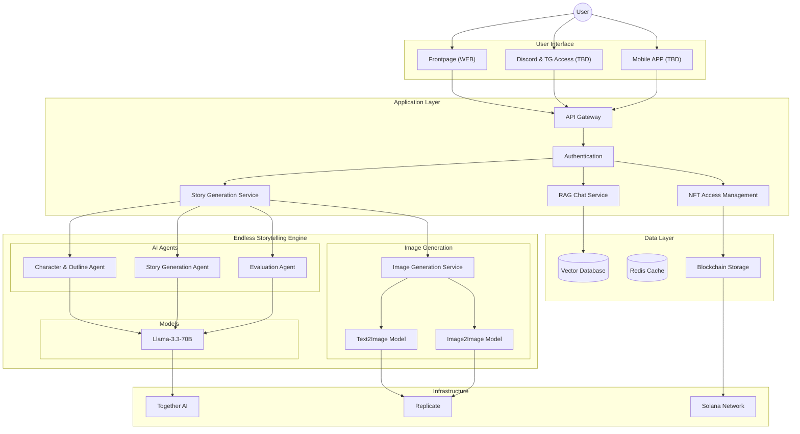
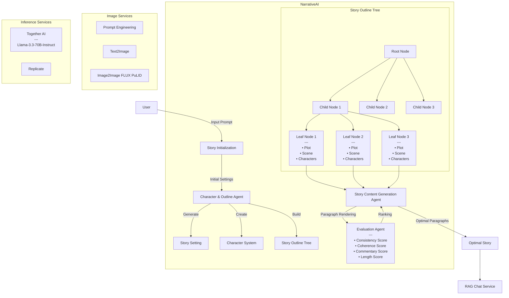

[![Python Version][python-image]][python-url]  
[![Package License][package-license-image]][package-license-url]  
[![Star][star-image]][star-url]  
[![Twitter][twitter-image]][twitter-url]

<p align="center">
  <a href="https://narrativeai.ai/">NarrativeAI</a> |
  <a href="https://github.com/narrativeai/narrativeai-story-gen/tree/main/story_samples">Story Samples</a> |
  <a href="https://github.com/narrativeai/narrativeai-story-gen/blob/main/README.md">English</a> |
  <a href="https://github.com/narrativeai/narrativeai-story-gen/blob/main/README.zh-cn.md">中文</a>
</p>

---

# NarrativeAI: An Interactive Infinite Story Generation Framework Based on Multi-Agent

NarrativeAI pushes the boundaries of continuous long-form content generation, providing a fully automated or interactive high-quality novel generation system.

## Core Challenges

- **Plot Coherence**  
Maintaining a coherent narrative thread over thousands of words without contradictions.

- **Narrative Quality**  
Consistent style, character development, and logical plot progression are mandatory for immersion.

- **Technical Limitations**  
Despite LLM advancements (e.g., GPT-4, Llama 3.3), long-form generation remains a key AI frontier.

## NarrativeAI's Solution

NarrativeAI achieves stable generation of 4,000–5,000 word stories, with technical scalability to even longer works.

## Infinity Long Story Generator

### Architecture



### Agents

- Character & Outline Agent
- Story Content Generation Agent
- Evaluation Agent

Evaluation covers `consistency`, `coherence`, `commentary`, and `length`.

### Generation Process

- **Story Initialization**
- **World Building**
- **Story Structure Design**
- **Content Generation and Optimization**

All characters and illustrations maintain visual consistency via FLUX PuLID models.

### Workflow



---

## Interactive Story Generation

NarrativeAI allows users to:

- Customize plot outlines
- Define character backgrounds
- Branch story paths

---

## T2I and I2I Integration

- **Character Portraits**  
  Maintains consistency using Image2Image and PuLID.

- **Scene & Prop Generation**  
  Dynamic generation based on plot progress.

---

## RAG-based Character Interaction Chat

- **Real-time chat** with any story character.
- **Context-aware** and **personality-maintaining**.
- **Multilingual support** for interactions.

(See [StoryChatV1](https://github.com/narrativeai/story-chat-v1))

---

## How to Use

### LLM

- `Llama-3.3-70B-Instruct` (Together AI)
- Optional: `GPT-4o`, `Claude 3.5 Sonnet`
- Self-hosted `vLLM` backend also supported.

### Installation

```bash
pip install -r requirements.txt
pip install -e .
```

### Environment Variables

Create a `.env` with:

```
OPENAI_API_KEY=your_openai_key
TOGETHER_API_KEY=your_togetherai_key
FLUX_DEV_API_KEY=your_fluxdev_key
FLUX_PULID_API_KEY=your_fluxpulid_key
VLLM_API_URL=http://your_vllm_instance
```

### Start API Service

```bash
cd api
gunicorn -c gunicorn_config.py api:app
```

Generated outputs will be saved under `output/` (e.g., `premise.json`, `outline.json`, `story.txt`).

---

## FAQ

- **What languages are supported?**  
  English for generation. Multilingual character chats supported.

- **Where are examples?**  
  See [story_samples](./story_samples/).

---

## Contact

- Submit an Issue or Pull Request
- Email: info@narrativeai.ai

---

[python-image]: https://img.shields.io/badge/Python-3.10%2C%203.11%2C%203.12-brightgreen.svg
[python-url]: https://www.python.org/
[star-image]: https://img.shields.io/github/stars/narrativeai/narrativeai-story-gen?label=stars&logo=github&color=brightgreen
[star-url]: https://github.com/narrativeai/narrativeai-story-gen/stargazers
[twitter-url]: https://x.com/NarrativeAIAI
[twitter-image]: https://img.shields.io/twitter/follow/NarrativeAIAI?style=social&color=brightgreen&logo=twitter
[package-license-image]: https://img.shields.io/badge/License-Apache_2.0-blue.svg
[package-license-url]: https://github.com/narrativeai/narrativeai-story-gen/blob/main/LICENSE
