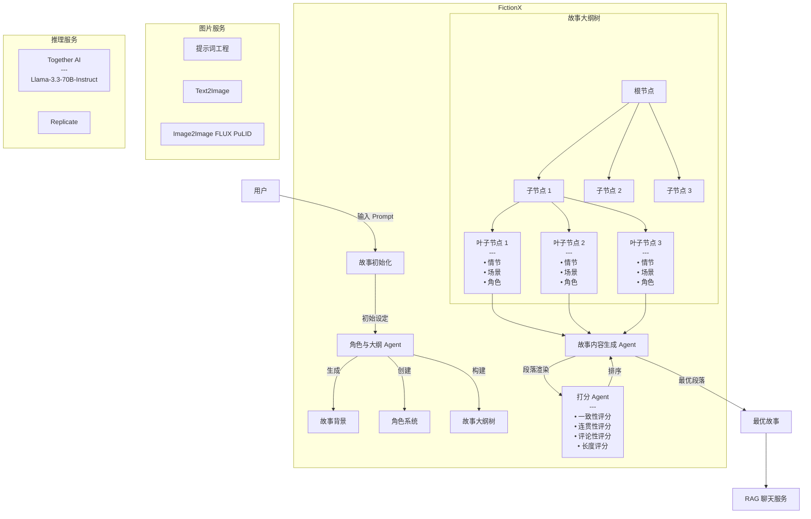

[![Python Version][python-image]][python-url]
[![Package License][package-license-image]][package-license-url]
[![Star][star-image]][star-url]
[![Twitter][twitter-image]][twitter-url]

<p align="center">
  <a href="https://fictionx.ai/">FictionX Website</a>
  <a href="https://github.com/fictionxai/fictionx-story-gen/blob/story_samples">Story Samples</a> |
  <a href="https://github.com/fictionxai/fictionx-story-gen/blob/main/README.md">English</a> |
  <a href="https://github.com/fictionxai/fictionx-story-gen/blob/main/README.zh-cn.md">中文</a> |
</p>


# FictionX：基于多智能体的交互式无限故事生成框架

本项目旨在探索和突破长篇内容连续生成的技术边界，为用户提供一个全自动或可交互的高质量长篇小说生成器。

## 核心挑战

相比于当前主流的短篇内容生成，长篇文章的自动生成面临着独特的挑战，关键问题有：

**情节连贯性**
在生成数千字的内容过程中，系统需要始终维持连贯的叙事主线。这不仅要求内容持续围绕用户给定的初始prompt展开，更需要确保在长篇创作中不出现情节矛盾或逻辑断裂，为读者提供流畅的阅读体验。

**叙事质量**
高质量的长篇内容需要在整体创作过程中保持稳定的写作风格，同时确保人物性格、背景设定等核心要素的一致性。必须能够构建合理的情节发展脉络，使故事既有张力又符合逻辑。

**技术限制**
尽管GPT-4、Llama3.3等大语言模型在自然语言处理领域取得了显著进展，但在处理长篇内容时仍面临挑战。长文本的上下文理解与连贯生成始终是人工智能领域亟待突破的研究方向。

## FictionX 框架

FictionX 专注于长篇故事生成技术，目前已实现稳定生成4,000-5,000词的故事内容。系统在技术上支持更长篇幅的创作，主要受限于质量评估的复杂性：如何定义一个好故事。

### Infinity Long Story Generator

#### 核心架构

整个框架由3个核心Agent构成：角色与大纲Agent、故事内容生成Agent，以及评分Agent（包含一致性、连贯性、评论性、篇幅长度4个维度的评分）。

#### 创作流程

故事生成采用多轮迭代方式，每轮包含规划、起草、写作和评分四个关键阶段：

**故事初始化**
根据用户输入的prompt，角色与大纲Agent自动生成匹配的故事标题和前情提要（premise）。同时，通过调用Text2Image服务，为故事创建一个能够体现核心主题的封面图像。

**世界观构建**
在这个阶段，它开始构建完整的故事世界。首先确立故事发生的背景环境（setting），然后创建一个包含主角、配角和背景角色的完整角色体系。每个角色都会获得独特的名字和个性描述，并调用Text2Image服务生成相应的角色肖像。

**故事结构设计**
角色与大纲Agent生成一个多层树形状的故事大纲结构。在这个树中，第一层节点定义了故事的整体走向，中间层节点代表重要的情节转折，叶子节点则展开了具体的事件、场景描述以及参与其中的角色信息。树的结构确保了故事发展的逻辑性和连贯性。

**内容生成与优化**
在内容生成阶段，故事内容生成Agent依次处理每个叶子节点。对于每个节点，进行4-8次独立的内容渲染，每次都会生成一个或多个段落。评分Agent会从一致性、连贯性、评论性和长度4个维度对内容进行，得分最高的段落成为小说的最终内容。

同时，Agent通过调用Image2Image服务的FLUX PuLID模型，确保角色形象在故事发展过程中的视觉一致性，并根据当前情节和场景上下文生成匹配的配图，增强故事的沉浸感。




### 交互式故事生成

FictionX 默认能够在没有人为干预的情况下，自动生成长篇故事。同时它也提供高度可控的交互选项，用户可以在高层次的情节大纲方面进行交互式定制，还自定义角色的背景和描述，也可以直接调整故事内容。

### 图像生成服务集成

FictionX 采用多模态生成技术，集成了先进的T2I(Text2Image)和I2I(Image2Image)模型：

-**模型选择**
主要使用Flux Dev作为核心模型，同时补充使用FLUX PuLID模型进行I2I处理。另外，图像生成服务基于Llama-3.3构建了专业的提示词工程系统，以优化生成图像的质量和准确性。

-**图像生成策略**
针对不同场景采用差异化处理方案。对于角色肖像，使用Image2Image结合PuLID来保持角色视觉形象的一致性；场景图片则基于当前情节内容和环境描述进行动态生成；对于故事中出现的关键道具，系统会根据具体描述生成相应的视觉呈现，增强故事的沉浸感。

-**质量保障**
实现了完整的质量保障机制，包括对每张生成图像进行实时的质量评估，在生成失败或质量不达标时启动自动重试机制，并通过风格一致性检查确保整个故事中的图像风格保持连贯统一。

### 角色互动聊天

FictionX 基于检索增强生成(RAG)技术，实现了与小说角色进行互动聊天的功能：

-**数据构建流程**
故事完成后，FictionX 会自动进行向量化处理，将角色、场景、情节等信息存储到本地文件形式存储的向量数据库中。

-**交互功能**
支持用户与故事中的任意角色进行实时对话。所有角色的回复都基于故事上下文动态生成，同时严格保持角色的性格特征和独特的说话风格。为提升用户体验，故事完成后，FictionX 还支持多语言交互，让来自不同语言背景的读者都能与角色进行自然对话。

详细的聊天系统实现请参考 [StoryChatV1](https://github.com/fictionxai/story-chat-v1)。

## 如何使用

### LLM

FictionX 基于Meta的Llama-3.3-70B-Instruct开发和测试，这是一个经过指令微调的大规模模型，能够精确理解和执行复杂的文本生成任务。推理服务由TogetherAI提供。

为提供更灵活的选择，本框架同时支持多种模型服务方案。用户可以通过OpenAI的API直接使用GPT-4或GPT-4o。根据测试结果，GPT-4o在严格遵守指令方面表现优异，而Claude3.5 Sonnet在指令遵循度上略有不足。对于具备GPU算力的用户，框架也支持通过VLLM调用自建的模型服务，用户可根据实际需求灵活切换。

### 安装

FictionX支持多种操作系统，主要在 Python 3.10 环境进行了开发和测试。

```
pip install -r requirements.txt
pip install -e .
```

### .env配置项

- `OPENAI_API_KEY`
- `TOGETHER_API_KEY`
- `FLUX_DEV_API_KEY`
- `FLUX_PULID_API_KEY`
- `VLLM_API_URL`

### 启动API服务

```
cd api
gunicorn -c gunicorn_config.py api:app
```

执行后会在当前目录下创建`output/`文件夹，用于存储生成的内容，包括：
-故事前提（premise.json）
-故事大纲（outline.json）
-完整故事内容（story.txt）

## 常见问题

-**支持哪些语言？**
目前故事生成仅支持英语。后续计划通过在用户输入初始提示词的阶段，添加语言指令来支持多语言创作。不过在角色聊天功能中，用户可以使用任何语言与故事角色进行交流。

-**有示例内容吗？**
可以在[示例](./story_samples/)中查看已生成的故事样本。

## 联系我们

如有任何问题或建议，欢迎通过以下方式与我们交流：
- 提交Issue或者创建PullRequest等，
- 发送邮件至info@fictionx.ai，我们将及时回复。

[python-image]: https://img.shields.io/badge/Python-3.10%2C%203.11%2C%203.12-brightgreen.svg
[python-url]: https://www.python.org/
[star-image]: https://img.shields.io/github/stars/fictionxai/fictionx-story-gen?label=stars&logo=github&color=brightgreen
[star-url]: https://github.com/fictionxai/fictionx-story-gen/stargazers
[twitter-url]: https://x.com/FictionXAI
[twitter-image]: https://img.shields.io/twitter/follow/FictionXAI?style=social&color=brightgreen&logo=twitter
[package-license-image]: https://img.shields.io/badge/License-Apache_2.0-blue.svg
[package-license-url]: https://github.com/fictionxai/fictionx-story-gen/blob/main/LICENSE
